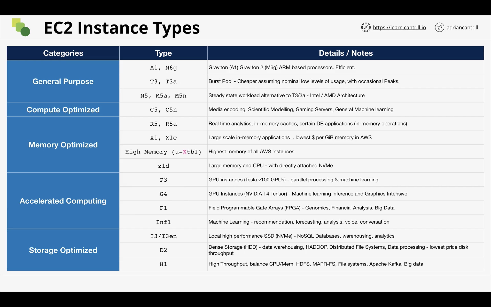

# EC2

## EC2 Architecture

EC2 instances are virtual machines and they run on dedicated EC2 hosts. EC2 hosts means hardware resources that are running the EC2 instances. Hosts can either be shared or dedicated. By default each instance is launched in a shared host but if we want dedicated hosts, then we only have to pay for the host and not for the instance. **Instances are AZ resilient.**

EC2 instances are launched in a specific subnet of a VPC. Since a subnet also is a part of an AZ, the EC2 instance are only available in ONE AZ. The EC2 host is also available per AZ and it has 3 things:

1. Instance Store: This is a store that EC2 instances can use for short term memory.
2. Data Network.
3. Storage Network

EC2 instances can also connect to an EBS (Storage system in AWS), cand EBS also is AZ resilient. The idea that we want everyone to understand is that, EC2 instances are a part of an AZ. It is important to remember, EC2 hosts can have a specfic configuration of networking, CPU and memory and so can each instance of EC2. Also, cross communication between instances of different AZs is not possible.

### What is EC2 Good for?

1. Traditional Application + OS requirement.
2. Long running time compute.
3. Server style applications.
4. Monolithic applications.

## EC2 instance types

EC2 instance types controls what type of CPU, memory and networking capabilities are present in the virtual machine. The decision of the type of EC2 instance affects the way applications run.

### EC2 Categories

1. General Purpose: This is the default category of the instance and here the ration of compute, memory networking is equal. This should always be the default instance type to pick.
2. Compute Optimised: These instances are optimized for raw computing power and used in HPC, Machine Learning, Image Processing, Gaming etc.
3. Memory Optimised: IN memory dataasets, high caching systems etc.
4. Accelerated Computing: GPU and Field accelerating Computing systems.
5. Storage Optimised: These machines are used where there is heavy sequqntial or random IO like data warehousing, ElasticSearch etc.

### Decodig EC2 types

_R5dn.8xlarge_ => This is a type of instace. Lets try and decode it.

R: Instance Family, 5: Generation, dn: Additional Capabilities, 8xlarge: Instance Size (Controls the memory and CPU)

Resources to learn:

1. <https://instances.vantage.sh/>
2. <https://aws.amazon.com/ec2/instance-types/>

### Practical

1. We can use SSH Keypair to get into EC2 instances or use EC2 instance connect. The key difference is that EC2 instance connect does not use your own local IP to connect to the instance.
2. For production use, allowing all IP addresses to connect does not make sense. Instead a better way is to use <https://ip-ranges.amazonaws.com/ip-ranges.json> and check the IP Address of the EC2 instance connect.
