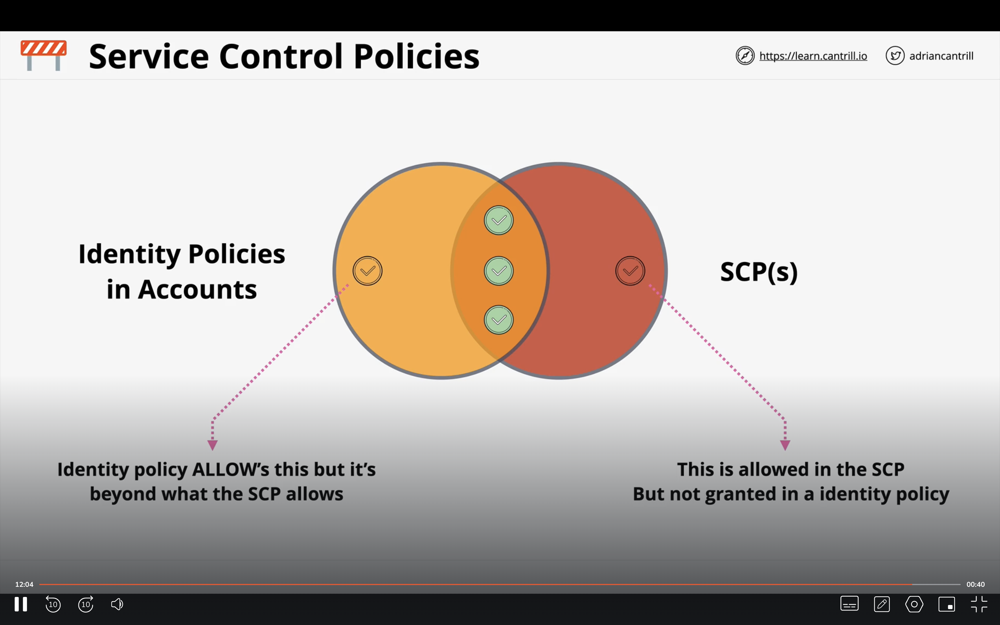

# Identity and Access Management

Each AWS account that is created has its own instance of IAM database. With IAM we can create different identities in our AWS accounts. There are 3 types of identities that are there in AWS: users, groups and roles. We will discuss in detail, what each of them mean.

## IAM Policies

IAM Policies are used to control the authorization of different identities in an AWS account. IAM Policies are described using a policy document. The policy document is created in JSON format. Each policy documents has a list of statements that look like this:

```JSON
{
    "Sid": "FullAccess",
    "Effect": "Allow", //This can be allow or Deny.
    "Action": "s3:*", //This is the action.
    "Resource": ["*"] //This is the AWS resource for which this statement applies.
}
```

Any interaction on AWS has two parts: An action that is performed and the resource on which the action is performed. Each statement contains these 2 keys that control the action and the resource. Understanding IAM policies when there is only one policy is easily.

### Dealing with multiple IAM Policies

As mentioned understanding 1 statement is easy. But suppose there are multiple statements in different IAM policy documents attached to a user, we need to understand how these statements apply. There is a consistent rule to understand multiple statements:

1. Explicit Deny: This always takes priority.
2. Explicit Allows: This takes second priority.
3. Deafult Deny: This takes 3rd priority.

What this rule means is that by default EVERYTHING is denied to an IAM identity. We have to explictly allow or deny authorization of resources.

### Types of IAM Policies

1. Inline policies: These are policies that are directly attached to an AWS Identity.
2. Managed policies: These are indivisual objects that are stored in AWS and can be attached to AWS identities.

Managed policies should be the default way of creating policies. They are reusable and have a low management overhead.

## IAM Users and ARNS

IAM users are an identity used for anything requiring long term AWS access eg. Humans, Applications or Service Accounts. If there is only one person or application that requires access, then IAM user is the correct IAM identity to use.

### Authentication

Lets suppose there is a principal who wants to access an AWS account. A principal can be a human being or an application. The first thing that they need to do is to authenticate itself against an IAM identity. If its an IAM user then the authentication can happen either via username and password or via the access keys. Once IAM authenticates the principal, it becomes an Authenticated Identity in the AWS account.

### Authorization

If the Authenticated User tries to access a resource in an AWS account, then we first check all the statements that are attached to that identity. This process of checking the policies and allowing or denying access to resources is called Authorization.

### ARNs

ARNs are used to uniquely identify resources within any AWS account. It looks something like this:

**arn:partition:service:region:account-id:resource-id**

1. 5000 IAM users per account.
2. IAM User can be a member of 10 groups.

## IAM Groups

IAM Groups are just a container for users in an AWS account. They do not have their own credentials. Multiple identities can be a part of one group and each identity can be a part of multiple groups. Each group can have inline or managed policies attached to them. We can create atmost 300 groups in an account. There is no default ALL group created in AWS.

_NOTE: Groups are not a true identity. They are not considered a principal in AWS and hence cannot be references using an ARN._

## IAM Roles

### Tech Introduction

IAM Roles are another type of identity in AWS. Unlike IAM Users, IAM roles are assumed for some time and then they stop being used. We can attach inline policies or managed policies to an IAM role. These are the things that we need to know about roles:

1. Each IAM role has 2 policies attached to it: Trust Policy and Permissions Policy.
2. Trust policy controls which identities are able to assume this role. We can reference IAM users, resources or even external users.
3. Permissions policy, as discussed above controls the permissions of the role in the AWS account.
4. Each time a role is assumed by a principal, temporary security credentials are generated.
5. IAM roles are true identities in an AWS account, like IAM users. They can be references using ARNs.
6. Whenever a principal tries to assume a role, a security credential is generated using another AWS service called STS (Secure Token Service)

### When to use IAM Roles

#### AWS Services

There are a lot of scenarios where an AWS service itself needs permissions to do an action of other AWS service. A good example is AWS lambda function. AWS Lambda functions are serverless functions that run in their environment. To get access from Lambda function to an EC2 instance, we might need to either hardcode the access keys and login as an IAM user, or ASSUME an IAM Role that has the correct permissions policy. We can attach the Lambda execution Role to AWS Lambda to do this.

#### Emergency Situations

Sometimes, if we want to temporararily give permissions to do an action, then we can use IAM Roles.

#### Using existing Identity Provider

Suppose a large scale company already has an existing Identity Provider, then IAM roles are a great way to enable SSO for these users. We will discuss more about how this can be done in Identity Federation.

### Service-linked roles and PassRole

IAM Role linked to a specific AWS service. These are predefined by the service and it provides permissions that a service needs to interact with other AWS services on your behalf.

## AWS Organisations

AWS Organisations is a way to manage multiple AWS accounts in an organisation. Every AWS account created is a standard AWS account. We can create an AWS organisation using a standard account. When an organisation is created using the account, the account becomes a management account. The management account can then invite other AWS accounts to join the organisation. Accounts that join the organisation are referred to as member accounts. These are the things that we need to know about AWS Organisations:

1. Each member account of an organisation does not have its own billing method. All the billing is managed by the management account and not the member accounts. This reduces the financial overhead.
2. The way to manage users in an Organisation is to have one dedicated account (can be management or member) for identities in an organisation and use IAM roles to access other member accounts.

### IAM management in AWS Organizations

1. We create an admin in the management AWS account or member account which is responsible for identities.
2. We create a role in the member account that allows access to the identity account. We give it the correct permissions.
3. Now we go back to the identity account, and click on switch role from the top right. We provide the account ID and the role that we want to assume.

### Service Control Policies

Service Control Policies are used to limit what an AWS account can do in an organisation. They cannot allow or deny permissions to an IAM identity. They just tell you which services can be used within an AWS acount.

There are 2 types of SCPs, Allow List and Deny List. Deny List means that by default everything is allowed and we by default set the actions that we want to restrict. Allow list is the opposite of DenyList and we have to explicitly allow the actions. The diagram below helps understand the permissions for an AWS account:


