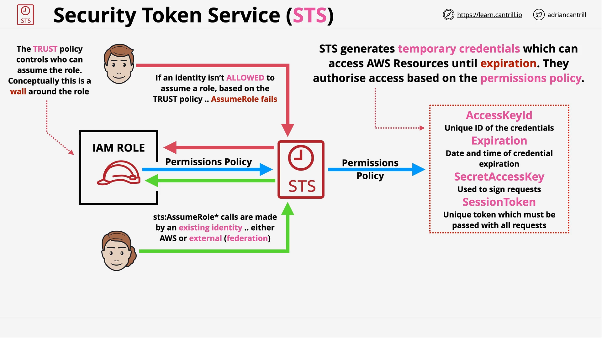

# Secure Token Service

This is the service that is used when we create IAM roles.

STS generates temporary credentials. They are similar to access keys but they expire and DO NOT belong to the identity that uses these keys. They have limited access and can be used to access AWS resources.

