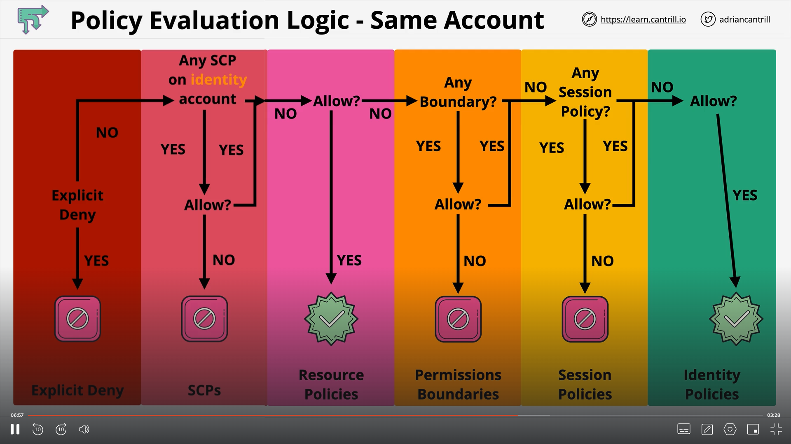

# Understanding Policies

## Policy 1

```JSON
{
    "Version": "2012-10-17",
    "Statement":
    [
      {
        "Effect":"Allow",
        "Action":[
           "s3:PutObject",
           "s3:PutObjectAcl",
           "s3:GetObject",
           "s3:GetObjectAcl",
           "s3:DeleteObject"
        ],
        "Resource":"arn:aws:s3:::holidaygifts/*"
      },
      {
        "Effect": "Deny",
        "Action": [
          "s3:GetObject",
          "s3:GetObjectAcl"
        ],
        "Resource":"arn:aws:s3:::holidaygifts/*",
        "Condition": {
            "DateGreaterThan": {"aws:CurrentTime": "2022-12-01T00:00:00Z"},
            "DateLessThan": {"aws:CurrentTime": "2022-12-25T06:00:00Z"}
        }
      }
    ]
}


```

Each Policy Document in AWS, has one or more statements. Each statement has an effect, an action and a resource. It is important to remember the way permissions work in AWS:

1. Explict Deny.
2. Explicit Allow.
3. Default Deny.

The condition part, as with the second statement, tells us that the effect, action and resource only applies if the condition mentioned is met. Since there are 2 conditions, it applies an AND operation between the conditions.

## Policy 2

```JSON

{
    "Version": "2012-10-17",
    "Statement": [
        {
            "Sid": "DenyNonApprovedRegions",
            "Effect": "Deny",
            "NotAction": [
                "cloudfront:*",
                "iam:*",
                "route53:*",
                "support:*"
            ],
            "Resource": "*",
            "Condition": {
                "StringNotEquals": {
                    "aws:RequestedRegion": [
                        "ap-southeast-2",
                        "eu-west-1"
                    ]
                }
            }
        }
    ]
}

```

If we ONLY have this policy, then it will not make sense because by default anyway everything is denied to an Identity. Single deny statements are almost always used with some allow statements.

**NotAction** => This is the inverse of action block and tells you things that you DO not want to act on. If we carefully look at the NotAction block, all the services are global.

**The meaning of this policy is, that we want to deny access to all resources except the ones mentioned in NotAction if the region is not ap-southeast-2 or eu-west-1.**

## Policy 3

```JSON

{
    "Version": "2012-10-17",
    "Statement": [
        {
            "Effect": "Allow",
            "Action": [
                "s3:ListAllMyBuckets",
                "s3:GetBucketLocation"
            ],
            "Resource": "*"
        },
        {
            "Effect": "Allow",
            "Action": "s3:ListBucket",
            "Resource": "arn:aws:s3:::cl-animals4life",
            "Condition": {
                "StringLike": {
                    "s3:prefix": [
                        "",
                        "home/",
                        "home/${aws:username}/*"
                    ]
                }
            }
        },
        {
            "Effect": "Allow",
            "Action": "s3:*",
            "Resource": [
                "arn:aws:s3:::cl-animals4life/home/${aws:username}",
                "arn:aws:s3:::cl-animals4life/home/${aws:username}/*"
            ]
        }
    ]
}
```

1. The first statement allows access to LIST all the buckets in S3. Only List, not peek.
2. The second statement allows you to List the contents of the bucket animals4life.
3. The third statement allows you to do everything in your own username's home folder.

## Policy Evaluation Logic

1. Service Control Policies (SCPs)
2. Resource Policies
3. IAM Identity Boundaries
4. Session Policies
5. Identity Policies

This diagram helps us in evaluating policies.


