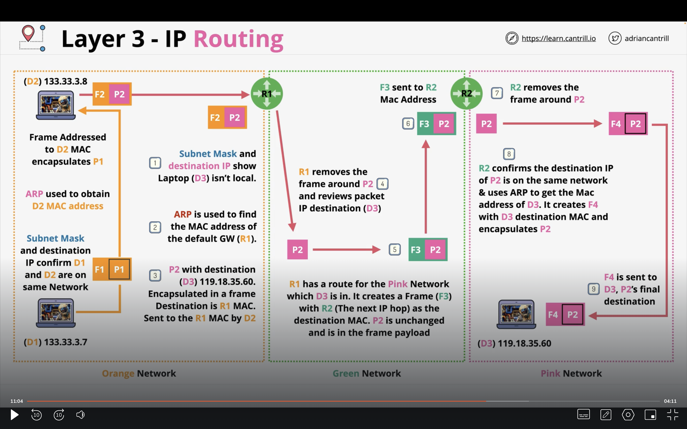

# Networking

## OSI Model

OSI (Open Systems Interconnection) Model is a conceptual model that explains how networking works between different devices connected via the internet.

### Physical Layer

Each layer of the OSI model, defines a specification or a standard that is followed. The physical layer is responsible for sending and receiving raw binary data from one device to the other over a shared physical medium. The shared physical medium can be copper cable (electicity) or fibre (light) or WIFI (Radio frequency). A network interface card is used at physical layer.

The things that a layer 1 network does not provide are:

1. No media access control. What that means is that there is no way to control which device will transmit onto the physical network.
2. No uniquely indentified devices. Eveyrhting is broadcasted over the shared physical medium.

### Data Link Layer

Data link later builds on top of the layer 1 network and introduces the concept of frames. Data link layer introduces a unique identifier for all physical devices called the **MAC address**.
Frame is the container that is used to transmit data over layer2. It has the following parts:

1. Preamble: This tells us the start of a new frame.
2. Destination MAC Address
3. Source MAC Address
4. ET: Ethernet type defines the protocal used by layer 3.
5. Payload: Data that layer 3 puts in layer 2.
6. Final Checks.

This frame is then transmitted over layer 1 and then the destination layer 2 interprets the frame and gives the ET and payload to layer3.

Layer 2 also gives us media access control and collision detection. Layer 2 checks for carrier signals on layer 1 using CSMA and if there is a carrier signal, it waits before sending data to the physical layer. This avoid collisions to happen on layer 1. If a collision does occur on layer 1, then layer 2 can also do collision detection. A random backdrop time is sent back to each layer 2 device and only when the backrop time is elapsed is when the layer 2 network can send data over through layer 1.

Similar to hubs in layer 1, layer 2 has a networking device called a switch. Switches are smart devices and not dumb like hubs. Switches can do the following things:

1. They can route smartly using the MAC address in the frame and the mac address table.
2. It can relay collisions only to the device that caused the collision instead of all devices.
3. Avoid collisions by storing and forwarding.

### Network Layer

Layer2 networks solve for a local area network. Now let us imagine a situation where we have a local network in one part of the world, and another local network in another part of the world. Without a layer 3 protocol, both the layer 2 networks need to be using the same standards and also need to be physically connected. That is not the case in any network. The layer 3 protocol is reponsible for transferring IP packets from source to destination by encapsulating frames. Layer 3 of the networking model consists of IP addressing and routers.

To understand layer 3 let us first understand how an IP packet looks like:

1. Source IP address.
2. Destination IP address.
3. Protocol: Protocol of layer 4. (TCP or UDP)
4. Data
5. TTL (Time to Live)

IP packets remain same throughout its journey. Layer3 is responsible for converting this layer3 packet into layer2 frames. A packet becomes a part of many layer2 networks before it reaches its destination.

**IP Addresses**

IPV4 addresses are a 32 bit address that is used to uniquely identify the devices over the internet. They use the dotted notation. For example:

133.33.24.17 and 133.33.2.7 => These belong to the same local network. Its the subnet mask that allows the HOST to determine if an IP address that it needs to communicate with is local or remote - which influences if it needs a gateway or can communicate locally. Typically a subnet mask is something like 255.255.0.0. The subnet mask is used to identify WHICH part of the IP address is the network part and which is the host.

Let us take an example. Suppose I want to reach AWS's server. How can I do that?

1. First I create a packet on my own device with the source IP address as 133.33.3.7. Suppose AWS's IP address is 52.1.7.6.
2. The ISP or the internet router is responsible for sending the packet. It first checks using a subnet mask if the destination IP address belongs to the same network.
3. Eaech router has something called a route table. which has information around what the next hop target should be. Each packet goes thorugh multiple hops to reach its destination IP address.

The layer3 protocol needs to know the mac address of the destination IP addres. This resolution of the MAC address based on the IP address is done by Address resolution protocol.

The things that layer3 does not solve:

1. It does not explicitly tell which application of the IP address needs to receive the packet.
2. The packets can be out of order and there is no gurantee made on layer3.
3. There is no flow control.

### Transport Layer

Layer3 as discussed has some drawbacks. Layer3 treats each packet as an indivisual. There are 2 standards that are used in layer4: TCP and UDP.

**TCP**

Transfer Control Protocol. If you want a slow but reliable transfer protocol then TCP should be used. TCP has a encapsulation called Segments. Segments are a part of the IP packet. Each segment consists of the following:

1. source and destination ports. This helps in creating channels betwen applications in a device. A combination of the IP address and the port is what makes creation of these channels possible.
2. Sequence numbers: To identify the order of the segments.
3. ACK: Every segment that is trasnmitted needs to be acknowledged. This helps us know if a packet is received correctly.
4. window: This parameter helps us in flow control.
5. checksum: This is used for error checking.

TCP is a connection based system. It is a 3 way handshake system for connection.

**UDP**

User Datagram Protocol. UDP is fast and not reliable.

### Session Layer

There are two types of connections that are possible:

1. Stateless traffic: Here the firewall has to explicitly define rules around what traffic is allowed and what is not allowed.
2. Stateful traffic: Here the traffic is implicit. Stateful firewall accepts traffic.

## NAT (Network Address Translation)

1. NAT is designed to overcome IPV4 shortages. It also provides some security benifits.
2. Translates private IPv4 addresses to public IP addresses.
3. Usually we use port address translation method.
