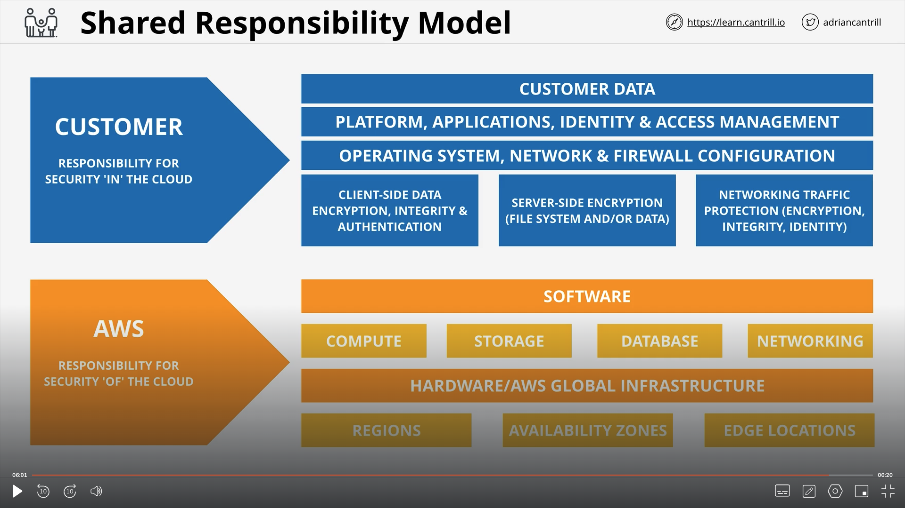

# AWS Fundamentals

## AWS Public vs Private Services

There are 3 different network zones in AWS:

1. Public Internet Zone: This is the internet. It is a public network that is accessible to everyone.
2. Private Network Zone (VPC): This is a private network that is only accessible to you. You can control who can access it.
3. AWS Public Zone: This is the network zone which can talk to the public internet when configured.

We will understand the details of how these networks work in the upcoming sections.

## AWS Global Infrastructure

### AWS Regions

Regions are physical locations in the world where the infrastructure of AWS exists. There are regions in different continents of the world. Each region has multiple Availability Zones (AZs).

1. Regions are completely isolated from each other.
2. Geopolitical boundaries are respected.
3. Each region has multiple Availability Zones. AZs are isolated locations within a region. AZs are logical data centers.

There are 3 types of resilience in AWS:

1. Globally resilient: This is the highest level of resilience. It is resilient across the globe.
2. Regionally resilient: This is resilient within a region.
3. Availability Zone resilient: This is resilient within an Availability Zone.

### AWS Edge Locations

Edge locations are endpoints for AWS which are used for caching content. Typically, this consists of CloudFront, Amazon's Content Delivery Network (CDN).

## VPC Basics

VPCs are virtual networks created inside AWS. A VPC is specific to a region. There are 2 types of VPCs: Default VPC and Custom VPC.
There can be multiple custom VPCs created in a region but only one default VPC. They are regionally resilient. The way VPCs are regionally resilient is by having a subnet per AZ of a region.

## Elastic Compute Cloud (EC2) Basics

1. EC2 is IAAS (Infrastructure as a Service). It is a virtual server in the cloud.
2. EC2 instances are virtual machines that run on physical servers in AWS data centers.
3. EC2 instances are launched in a VPC subnet. This makes EC2 instances AZ resilient.
4. AMI (Amazon Machine Image) is a template that contains the software configuration (OS, application server, and applications) required to launch an EC2 instance. AMIs can have different permissions based on the author.

EC2 is the default compute service that AWS provides. It is the most commonly used AWS service.
EC2 instances are charged per second after the first minute of launch. An instance can be in the following 3 states: running, stopped and terminated. Running and stopped instances can still incur costs for an EC2 instance whereas a terminated instance costs nothing.

## Simple Storage Service (S3) Basics

1. Global object storage. It is a regional resilient service.
2. It should be the default storage service in AWS. There are only a certain set of usecases where S3 might not be the default storage service.
3. S3 has two components, an object and a bucket.

### Objects

Objects have two components:

1. Key: This is the unique name of an object in an S3 bucket.
2. Value: This is the content of the object. It can range from 0bytes to 5TB.

### Buckets

Buckets have two components:

1. Name: This is the unique name of the bucket. This name is unique globally.
2. Region: This is the region where the bucket is located.

Buckets are a flat structure. They are not hierarchical. It is not possible to create a subfolder in an S3 bucket. It is possible to create multiple buckets in a single region.

All S3 buckets are private by default. No one outside of the AWS account can access the bucket. The block all public access button while creating a bucket is used to prevent the bucket from becoming public.

### Summary

1. Bucket names are globally unique.
2. 3-63 characters.
3. Buckets - 100 Soft Limit, 1000 hard limit.
4. S3 should be the default for any INPUT and OUTPUT to MANY AWS products.

## CloudFormation Basics

CloudFormation is a service that allows you to provision AWS resources using a template. It is a declarative service. We use YAML or JSON to create a template. Templates can define conditions, parameters, outputs and other resources.

In the template we create logical resources. These logical resources ceate a stack in CloudFormation. A stack is a collection of AWS resources that are provisioned together. When a stack is deleted, it deletes all the resources that it created.

## CloudWatch Basics

CloudWatch is a service that allows you to monitor AWS resources. It is a monitoring service. It has 3 components:

1. Metrics: This is the data that is collected by CloudWatch.
2. Logs: This is the data that is collected by CloudWatch. We can action on these logs.
3. Events: AWS Services and Scheduled Events.

CloudWatch has the following components:

1. Namespace: This is the collection of metrics that are collected by CloudWatch.
2. Metrics: This is the data that is collected by CloudWatch.
3. Alarms: This is the condition that is evaluated by CloudWatch. When the condition is met, it triggers an alarm. There are 3 types of alarms: Metric, Composite and Alarm.

We can use a library called stress to emulate the load on our resources.

## Shared Responsibility Model

Lets explain it with a diagram:

## High Availability vs Fault Tolerance vs Disaster Recovery

### High Availability

Aims to ensure an agreed level of operational performance, usually uptime, for a higher than normal period. This has nothing to do with user experience. High availability means ability to recover from outages as quickly as possible. We represent HA using percentage of uptime.

1. 99.9% uptime: 8 hours p/year downtime.
2. 99.999% uptime: 5mins p/year downtime.

### Fault Tolerance

Is the property that enables a system to continue operating properly in the event of the failure of some of its component. HA is not operating through failures. FT is operating through failures. That makes FT more expensive.

Understanding the difference between HA and FT is important. As a solutions architect, we should understand the difference between HA and FT.

### Disaster Recovery

A set of policies,tools and procedures to enable the recovery or continuation of vital tech infrastructure following a natural or human induced disaster.

## Route 53 Fundamentals

Route53 is a Global service and it can do 2 things: Register Domains and Host Zones.

As we know DNS namespaces are there with the companies that manage it. When we register a domain name in Route53, it creates a Zone File. A zone file is a file that contains the DNS records for a domain name. It is a text file that contains the DNS records for a domain name.

## DNS Record Types

1. Nameserver Record (NS): This is a record that points to another DNS server.
2. A Record (A): This is a record that points to an IP address.
3. AAAA Record (AAAA): This is a record that points to an IPv6 address.
4. CNAME Record (CNAME): This is a record that points to another domain name.
5. MX Record (MX): This is a record that points to a mail server.
6. TXT Record (TXT): This is a record that contains text data.
7. SRV Record (SRV): This is a record that points to a service.
8. PTR Record (PTR): This is a record that points to a domain name.
