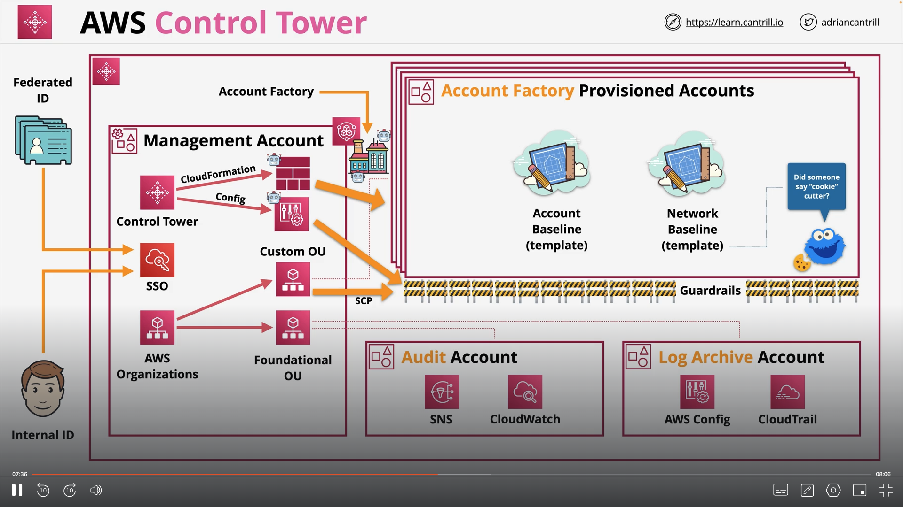

# IAM, Accounts and AWS Organisations

## IAM Identity Policies

Identity policies are used to control the authorization of different identities in an AWS account. Each Identity policy consists of one or more statements. Lets try and break what each statement does:

- Sid: This is the unique name of the statement. It is used to identify the statement.
- Effect: This is the action that is to be performed. It can be Allow or Deny.
- Action: These define the action that is being peformed on an AWS resorurce.
- Resource: Refers to an AWS resource. Usually a resource ARN.

There can be multiple policies and hence multiple statements that can be associated with an identity. It is important to understand what happens when AWS evaluates these statements. There is a consistent rule for evaluation:

- Explicity Deny: This always takes priority.
- Explicity Allow: This takes second priority.
- Default Implicit Deny: This takes 3rd priority.

There are 2 types of IAM policies:

- Inline policies: These are policies that are directly attached to an AWS identity.
- Managed policies: These are individual objects that are stored in AWS and can be attached to AWS identities.

Best practice is to always use Managed policies. Inline policies should be used for special or exceptional allow or deny.

## IAM Users and ARNs

IAM users are an identity used for anything requiring long term AWS access eg. Humans, Applications or Service Accounts. If there is only one person or application that requires access, then IAM user is the correct IAM identity to use.

In IAM there is a principal. Principal is any entity that is trying to get access to an AWS account. The first thing a principal needs to do is to prove they are who they say they are. This process of proving a principals identity is called Authentication. Once a principal is authenticated, they become an authenticated identity. Then when the authenticated identity tries to access a resource, the authorization process starts. This process of checking the policies and allowing or denying access to resources is called Authorization.

### Amazon Resource Names (ARNs)

ARNs are used to uniquely identify resources within any AWS account. It looks something like this:

**arn:partition:service:region:account-id:resource-id**

### Note

- 5000 IAM Users per account
- IAM users can be a member of 10 groups.
- Each IAM Group can have inline or managed policies attached to them.
- We can create atmost 300 groups in an account. There is no default ALL group created in AWS.

## IAM Groups

IAM Groups are just a way for us to organise IAM users in an AWS account. You cannot login as an IAM group. These are some points that we need to note:

1. IAM Groups have no limit to the number of IAM users that can be a part of them.
2. IAM Groups can have inline or managed policies attached to them.
3. There is no default All Users group created in AWS.
4. 300 groups can be created per account.
5. Groups are not a true identity. They are not considered a principal in AWS and hence cannot be references using an ARN.

## IAM Roles

We discussed the concept of a principal in the above sections. If we can imagine a single principal wanting access to our AWS account, then we use IAM users, whereas if we can imagine multiple principals wanting access to our AWS account, then we use IAM roles. IAM Roles are assumed, something becomes a role for a short period of time and then stop being the role. IAM roles have two type of poilcies:

1. Trust Policy: This policy controls which identities are able to assume this role. We can reference IAM users, resources or even external users.
2. Permissions Policy: This policy controls the permissions of the role in the AWS account.

When an identity assumes a role, a temporary set of credentials are generated using STS. The permissions policy is attached to the set of credentials that are generated.

### When to use IAM Roles?

1. Giving permissions for an AWS service to do an action on your behalf. Lets take an example. Suppose I have a Lambda function that needs to access an EC2 instance. I can give the lambda function the permission to assume an IAM role that has the correct permissions to access the EC2 instance. This is better then giving static credentials to the lambda function.

2. Emergency Situations. Sometimes, if we want to temporararily give permissions to do an action, then we can use IAM Roles.

3. Using existing Identity Provider. Sometimes, if we already have an existing Identity Provider, then we can use IAM roles to access other AWS accounts.

4. For cross account access. Sometimes, if we want to access other AWS accounts, then we can use IAM roles.

### Service-linked roles and PassRole

IAM Role linked to a specific AWS service. These are predefined by the service and it provides permissions that a service needs to interact with other AWS services on your behalf.

## AWS Organisations

There are a lot of usecases in the real world where there is a need for multiple AWS accounts. Each account has its own set of IAM users and billing details. This becomes very difficult to manage. AWS organisations is a way for users to be able to create a single entity for multiple accounts.

1. We have one management account and multiple member accounts. Management account is the account from which we create an AWS Organisations.
2. The structure of an AWS organisation is a tree. The management account is the root of the tree. Each member account is a leaf of the tree.

We can have consolidated billing for all the member accounts. We can have consolidated access control for all the member accounts. A better way to manage identities in an AWS organisation is to have one dedicated account (can be management or member) for identities in an organisation and use IAM roles to access other member accounts.

### AWS Organisations Demo Things to remember

1. If we create an account in an AWS organisation, then a role is automatically created in that account.
2. If we invite an account then we have to explicitly create a role in that account.

The role that is creatd is: OrganizationAccountAccessRole

## Service Control Policies

1. Service Control policies are attached to the root organisation or Organisation units inside an AWS Organisation.

2. SCPs do not affect the management account of an organisation.

3. SCPs affect what the member accounts can do in an organisation. They cannot allow or deny permissions to an IAM identity. They just tell you which services can be used within an AWS acount.

There are 2 types of lists that we can create for SCPs:

1. Allow Lists: Here we need to explicitly allow the actions that we want to allow in an AWS account. Everything else will be denied.
2. Deny Lists: Here we need to explicitly deny the actions that we want to deny in an AWS account. Everything else will be allowed.

By default when we enable SCPs, a Deny List is created. A FullAWSAccess Policy is created by default. We need to explicitly add the actions that we want to deny in an AWS account.

## CloudWatch Logs

- CW is a public service and is usable from within the AWS account or on permises.
- It is used to store, monitor and access logging data.
- Can generate metrics based on logs - metric filters.

Lets try and understand the architecture of CW logs:

1. There are a lot of logging sources.
2. These sources send a log event to Cloud Watch. Each event has a message and timestamp associated with it.
3. A collection of similar messages creates a log stream and a group of streams creates log groups.
4. On Log groups we can have a metric filter that can trigger alarms.

## CloudTrail

1. Cloudtrails logs every API action in an AWS account.
2. By default data for 90 days is stored. This storage is free of cost.
3. There are 2 types of events, management events and data events. Management events are API actions that are control only (eg: Creating an EC2 instance or creating a VPC). By default only management events are logged in AWS.

A logically unit in CloudTrail is a Trail. A single trail can be region specific or can be set to all regions. The AWS services logging to CloudTrail can log to a specific trail but global services are not logged. They need to be explictly set. For example: IAM. We can put the data in S3 or CloudWatch logs. We can even create organisational trails.

### Summary

1. Enabled by default ... but 90 days .. no S3
2. Trails are how you configure S3 and CWLogs
3. Management events only be default
4. IAM, STS, CloudFront => Global Service Events
5. NOT REALTIME - There is a delay

## AWS Control Tower

### Landing Zone

- Well architected multi-account environment
- Built using AWS Organisations, AWS Config, CloudFormation etc.
- Security OU is created which has log archive and audit accounts
- Sandbox OU is created for testing
- We can create other OUs

### Guard Rails

- Rules for multi-account governance
- Mandatory, Strongly Recommended or Elective
